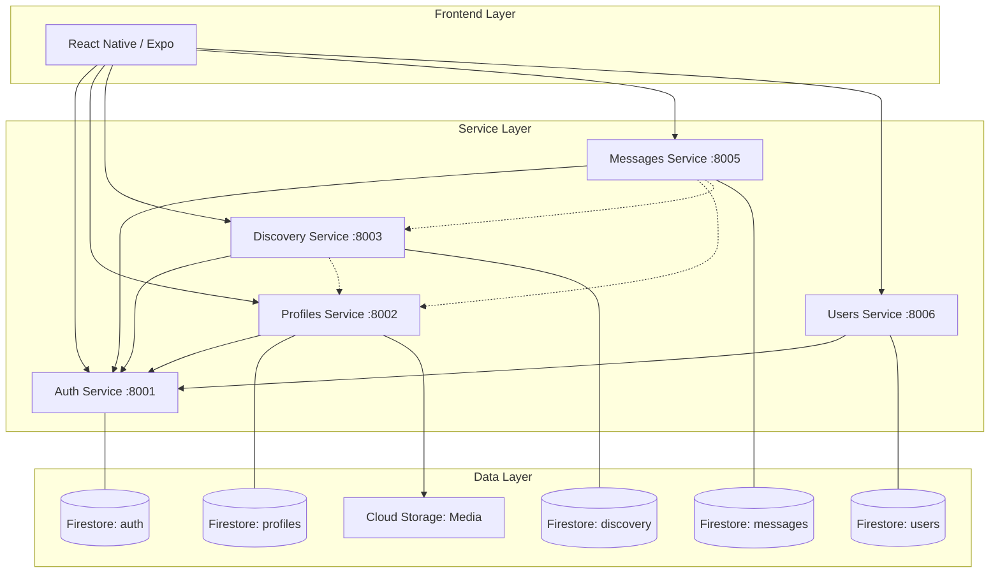

# Tavern Swiper Architecture Analysis

This document provides a technical overview of the Tavern Swiper application, covering both the frontend and backend microservices, infrastructure, and cross-service communication.

## 1. System Overview

Tavern Swiper is a hero-discovery application where users "forge" identities and discover other heroes (swipe). It consists of a **React Native (Expo)** frontend and a **Python (FastAPI)** backend composed of five microservices.

### Backend Microservices
All services are built with Python and FastAPI, utilizing Firestore for persistent storage.

| Service | Port | Responsibility |
| :--- | :--- | :--- |
| **Auth** | 8001 | Identity provider, Firebase account integration, and token verification. |
| **Profiles** | 8002 | Stores hero identities, attributes (Strength, Charisma, Spark), and portraits. |
| **Discovery** | 8003 | Logic for hero "feeds". Filters profiles based on matches and swipes. Handles swipe actions and match detection. |
| **Messages** | 8005 | Real-time messaging and chat history between matched heroes. |
| **Users** | 8006 | General user metadata (premium status, active profile ID, roles). |

---

## 2. Infrastructure & Data Persistence

### Database: Cloud Firestore
- **Dedicated Instances**: Each microservice has its own dedicated Firestore database instance, enforcing strict data isolation across the system.
- **NoSQL Schema**: High flexibility for profile attributes and changing game mechanics.
- **Media**: Profile portraits are stored in **Google Cloud Storage** (GCS), managed by the `profiles` service.

### Orchestration: Docker Compose
- **Local Dev**: Each service runs in a container on a shared `tavern-net` network.
- **Hot Reloading**: Persistent volumes map source code into containers for real-time development.

---

## 3. Communication Patterns

### Frontend to Backend
- **Tavern JWT Authentication**: The frontend initially identifies with Firebase, then exchanges the Firebase ID token for a custom **Tavern JWT**. 
- **Persistence & Hydration**: This JWT is persisted via `AsyncStorage`, allowing for instant authentication on app reloads without waiting for Firebase initialization or re-verification.
- **Service Hub**: The frontend communicates with services via a unified API client in `frontend/lib/api.ts`, which automatically handles token injection and deduplicated refreshing.

### Service to Service

- **Local Verification**: Downstream services (e.g., Discovery, Profiles) verify the **Tavern JWT** locally using a shared secret, eliminating the need for per-request calls to the Auth service.
- **Synchronous REST**: Services use `httpx` for inter-service communication (e.g., Discovery calls Profiles for hero data).

---

## 4. Frontend Architecture (React Native/Expo)

- **Navigation**: Filesystem-based routing via `Expo Router` with a tab-based primary layout.
- **State Management**: 
    - **React Query**: Handles server state, caching, and background synchronization. Profiles are "eagerly" loaded and cached globally upon login via the `ProfileProvider`.
    - **Context API**: Manages global UI states like the `ProfileContext` and handles the active profile selection.
- **Styling**: A centralized `theme` directory handles colors, typography, and spacing consistency.

---

## 5. Future Improvements

- [ ] **Asynchronous Matching**: Move match detection to an asynchronous worker to reduce latency during a swipe.
- [ ] **API Gateway**: Introduce a lightweight API gateway (like Kong or Nginx) to handle cors, rate limiting, and centralized logging.
- [ ] **Mobile UI Testing (Maestro)**: Automated native mobile testing via Maestro for Android/iOS emulator flows.

---

## Changelog

- **Phase 1 — Environment & Service Standardization**: Isolated environment profiles per service, fixed internal connectivity (`http://auth:8001`), surfaced infrastructure config into `.env` files.
- **Phase 2 — Configuration & Admin**: Retired standalone `admin.html`, implemented Nexus Admin Panel with role-based access control, ported "Claim the Root" initialization to mobile.

