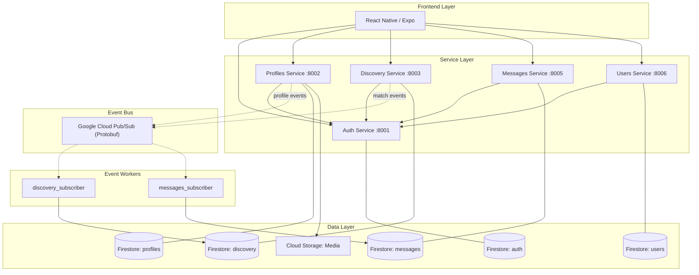

# Tavern Swiper Architecture

This document provides a technical overview of the Tavern Swiper application, covering the frontend, backend microservices, event-driven infrastructure, and cross-service communication.

## 1. System Overview

Tavern Swiper is a hero-discovery application where users "forge" identities and discover other heroes (swipe). It consists of a **React Native (Expo)** frontend and a **Go (Gin)** backend composed of five core microservices and two event-driven subscribers.

### Backend Microservices
All services are built with Go and the Gin framework, utilizing Firestore for persistent storage.

| Service | Port | Responsibility |
| :--- | :--- | :--- |
| **Auth** | 8001 | Identity provider, Firebase account integration, and Tavern JWT issuance/verification. |
| **Profiles** | 8002 | Stores hero identities, attributes, and portraits. Publishes profile events via Pub/Sub. |
| **Discovery** | 8003 | Logic for hero "feeds". Filters profiles from its local cache, handles swipe actions and match detection. Publishes match events via Pub/Sub. |
| **Messages** | 8005 | Conversation management and messaging between matched heroes. |
| **Users** | 8006 | General user metadata (premium status, active profile ID, roles). |

### Event-Driven Subscribers (Internal Workers)
Subscribers consume Pub/Sub events to maintain local read-caches across service boundaries, avoiding direct cross-service database access.

| Worker | Listens To | Writes To | Purpose |
| :--- | :--- | :--- | :--- |
| **discovery_subscriber** | Profiles service (profile upsert/delete events) | `profiles_profiles_cache` in Discovery DB | Keeps Discovery's profile cache fresh so the feed doesn't need to call the Profiles API in real-time. |
| **messages_subscriber** | Discovery service (match created events) | `discovery_matches_cache` in Messages DB | Keeps a local match cache so the Messages service can verify matches before allowing conversations. |

---

## 2. Infrastructure & Data Persistence

### Database: Cloud Firestore
- **Dedicated Instances**: Each microservice has its own dedicated Firestore database instance, enforcing strict data isolation across the system.
- **NoSQL Schema**: High flexibility for profile attributes and changing game mechanics. See [data_model.md](data_model.md) for full schemas.
- **Media**: Profile portraits are stored in **Google Cloud Storage** (GCS), managed by the `profiles` service.

### Orchestration: Docker Compose
- **Local Dev**: Each service runs in a container on a shared `tavern-net` network.
- **Hot Reloading**: Persistent volumes map source code into containers for real-time development.

---

## 3. Communication Patterns

### Frontend to Backend
- **Tavern JWT Authentication**: The frontend initially identifies with Firebase, then exchanges the Firebase ID token for a custom **Tavern JWT**.
- **Persistence & Hydration**: This JWT is persisted via `AsyncStorage`, allowing for instant authentication on app reloads without waiting for Firebase initialization or re-verification.
- **Service Hub**: The frontend communicates with services via a unified Axios-based API client in `frontend/lib/api.ts`, which automatically handles token injection and deduplicated refreshing.

### Service to Service

- **Local JWT Verification**: Downstream services (e.g., Discovery, Profiles) verify the **Tavern JWT** locally using a shared secret, eliminating the need for per-request calls to the Auth service.
- **Synchronous REST (Go `net/http`)**: Services use Go's standard `net/http` package for inter-service communication where needed (e.g., Users calling Auth for batch user deletion).
- **Asynchronous Events (Pub/Sub + Protobuf)**: Profile updates and match events are broadcast via Google Cloud Pub/Sub using Protobuf serialization, consumed by subscriber workers to maintain local read-caches.

---

## 4. The Match Lifecycle

Matches are a distributed event involving multiple microservices. No single service owns the entire state.

### Step-by-Step Flow

1. **Identity Creation (`Profiles` Service)**:
    * A user forges a hero identity.
    * `POST /profiles/` saves the profile to the `profiles` Firestore database.
    * A Pub/Sub event is published, which the `discovery_subscriber` consumes to update the local profiles cache.
    * The frontend must set `activeProfileId` immediately after creation to ensure the Discovery feed loads the correct context.

2. **Discovery Feed (`Discovery` Service)**:
    * The Tavern feed is generated by filtering the local `profiles_profiles_cache` for all active profiles *except* those belonging to the current `user_id` and those already swiped by the `activeProfileId`.
    * `GET /discovery/feed/{profile_id}`.

3. **The Swipe (`Discovery` Service)**:
    * When a user likes a hero, a swipe record is created.
    * `POST /discovery/swipe` with `swiper_profile_id`, `swiped_profile_id`, and `direction='right'`.
    * **Match Check**: The Discovery service automatically checks if a reciprocal RIGHT swipe exists from the target profile to the swiper. If it does, a **Match** record is created.
    * On match creation, a Pub/Sub event is published, which the `messages_subscriber` consumes to update the local match cache.

4. **Match Retrieval**:
    * `GET /discovery/matches/{profile_id}` returns all mutual matches for that specific identity.

### Common Gotchas
* **Authorization**: Every API call requires a Bearer Token. In tests, mock the token or capture it from Firebase Auth during setup.
* **Active Profile**: The Discovery feed requires an `activeProfileId` — tests must set this before querying the feed.

---

## 5. Frontend Architecture (React Native/Expo)

- **Navigation**: Filesystem-based routing via `Expo Router` with a tab-based primary layout.
- **State Management**:
    - **React Query**: Handles server state, caching, and background synchronization.
    - **Context API**: Manages global UI states via `ProfileContext` (`ActiveProfileContext`) for active profile selection.
- **Styling**: The **Stitch** design system (`frontend/theme/tokens.ts`) provides centralized colors, typography, and spacing consistency.

---

## 6. Testing & Verification

The Tavern Swiper project employs a multi-layered testing strategy. For detailed instructions, see [testing.md](testing.md).

### Unit Tests
- **Backend (Go)**: Run using `go test -v ./...` from the respective service directory (e.g., `services/auth_go`).
- **Frontend (Node/Jest)**: Run using `npm test` exclusively from within the `frontend/` directory.

### Integration Tests
- **System Lifecycle**: Located in `tests/integration/`, these tests verify cross-service workflows against the Cloud environment or local Docker.

### UI Anchors
- The Discovery screen (`index.tsx`) contains `swipe-left-button` and `swipe-right-button` `testIDs` for reliable interaction testing.

---

## 7. Future Improvements

- [ ] **API Gateway**: Introduce a lightweight API gateway (like Kong or Nginx) to handle CORS, rate limiting, and centralized logging.
- [ ] **Mobile UI Testing (Maestro)**: Automated native mobile testing via Maestro for Android/iOS emulator flows.
- [ ] **Swagger/OpenAPI**: Interactive API documentation for each service. See [proposals/go-swagger.md](proposals/go-swagger.md).

---

## 8. Identity & Environments

### Shared Identity Pool
Even though application data is isolated into `dev` and `test` Firestore database instances, they share a single **Firebase Auth** instance.
- **Global UID**: A user (identified by email) will have the same UID in both environments.
- **Shared Passwords**: Changing a password in one environment affects the account globally across the project.
- **Data Isolation**: While the identity is shared, the profile data, messages, and swipes are stored in environment-suffixed Firestore databases (e.g., `profiles-dev` vs `profiles-test`), ensuring no cross-contamination of application state.

---

## Changelog

- **Phase 1 — Environment & Service Standardization**: Isolated environment profiles per service, fixed internal connectivity (`http://auth:8001`), surfaced infrastructure config into `.env` files.
- **Phase 2 — Configuration & Admin**: Retired standalone `admin.html`, implemented Nexus Admin Panel with role-based access control, ported "Claim the Root" initialization to mobile.
- **Phase 3 — Go Migration & Pub/Sub**: Ported all 5 services from Python/FastAPI to Go/Gin. Implemented event-driven caching via Pub/Sub with Protobuf serialization. Added `discovery_subscriber` and `messages_subscriber` workers.
- **Phase 4 — Server Timestamps**: Standardized all microservices to use `firestore.ServerTimestamp` for `created_at` and `updated_at` fields, replacing application-level `time.Now()`.
- **Phase 5 — Messages Restructure**: Migrated Messages service from flat `messages` collection to `conversations` + sub-collection `messages` + `profile_conversations` lookup architecture.
- **Phase 6 — Match Celebration & Env Sync**: Implemented global `MatchSplash` animation. Refactored `clear_system.py` to preserve Firebase identities by default, preventing UID desynchronization between dev/test environments.
