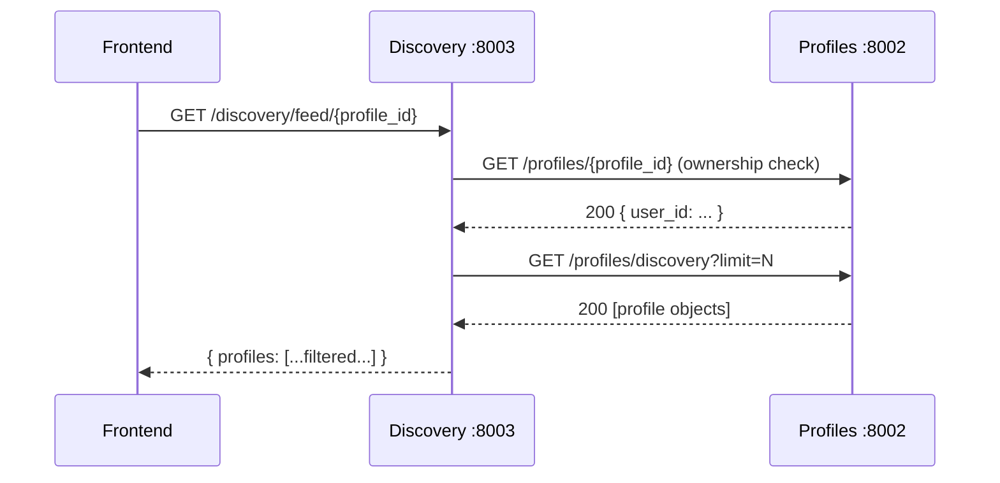
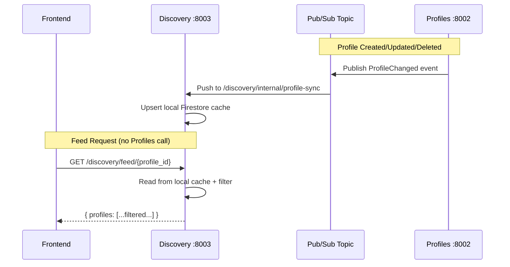

# Event-Driven Discovery: Architecture Analysis & Documentation Gaps

## 1. Current Problem: The Synchronous Proxy Bottleneck

Today, the Discovery service makes **synchronous HTTP calls to the Profiles service on every feed request** ([main.py:60-93](file:///home/peter/Documents/tavern_swiper/services/discovery/main.py#L60-L93)):

**Two synchronous calls per feed request.** This means:
- **Latency**: Discovery's P95 is gated by Profiles' P95 (plus network RTT)
- **Coupling**: If Profiles is cold-starting on Cloud Run, every feed request blocks
- **Redundancy**: Discovery re-fetches the same profile catalog on every call, even though profiles change rarely
- **Fragility**: The same pattern repeats in `record_swipe` ([main.py:113-124](file:///home/peter/Documents/tavern_swiper/services/discovery/main.py#L113-L124)) — another ownership check proxy call

---

## 2. Proposed Solution: Event-Driven Profile Cache

### Core Idea
Profiles service **publishes events** when profiles change. Discovery service **materializes a local cache** from those events and **never calls Profiles at runtime**.

### Recommended Technology: Google Cloud Pub/Sub

Given you're already on GCP with Firestore and Cloud Run, Pub/Sub is the natural fit. Firestore also supports [document change triggers via Eventarc](https://cloud.google.com/eventarc/docs/run/create-trigger-firestore), which can emit directly to a Cloud Run endpoint — zero new infrastructure.

### Target Architecture

### What Changes

| Component | Change |
|:---|:---|
| **Profiles Service** | Add Pub/Sub publish on create/update/delete. ~20 lines. |
| **Discovery Service** | Add internal `/discovery/internal/profile-sync` endpoint to receive events. Replace `httpx` calls with local Firestore reads from a new `profile_cache` collection. |
| **Infrastructure** | Create 1 Pub/Sub topic (`profile-events`) + 1 push subscription targeting Discovery's Cloud Run URL. |
| **docker-compose.yml** | Remove `depends_on: profiles` from discovery. Add Pub/Sub emulator for local dev. |

### What Stays the Same
- The "Shared Nothing" principle holds — Discovery still has its own Firestore DB. The `profile_cache` collection lives inside `discovery`'s database.
- Zero-trust auth stays — the internal sync endpoint uses Pub/Sub push authentication (OIDC token), not user Bearer tokens.
- Frontend is unchanged.

---

## 3. Incremental Implementation Steps

> [!TIP]
> You can do this in 3 phased PRs. Each one is independently deployable and testable.

### Phase 1: Profile Cache Collection (Discovery-side only)
- Add a `profile_cache` collection in Discovery's Firestore
- Add an internal endpoint `POST /discovery/internal/profile-sync` that accepts a profile payload and upserts it into `profile_cache`
- **Leave the existing httpx calls in place as fallback** — read from cache first, fall through to HTTP if cache miss
- Add unit tests for the sync endpoint

### Phase 2: Profiles Service Publishes Events
- Add `google-cloud-pubsub` to Profiles' requirements
- After every create/update/delete in [main.py](file:///home/peter/Documents/tavern_swiper/services/profiles/main.py), publish a `ProfileChanged` event (with action: `upsert` or `delete`)
- Wire Pub/Sub topic + push subscription (or Eventarc trigger) in infra
- Add integration test: create profile → verify cache updated in Discovery

### Phase 3: Remove the Proxy Calls
- Replace `httpx.AsyncClient` calls in Discovery with local `profile_cache` reads
- Remove the `PROFILES_SERVICE_URL` dependency from Discovery's `.env`
- Remove `depends_on: profiles` from `docker-compose.yml`
- Update all documentation

---

## 4. Documentation Gaps (AI-Agent Readability Focus)

I reviewed all documentation surfaces: `README.md`, `architecture.md`, `.cursorrules`, `.agents/ARCHITECTURE_DEEP_DIVE.md`, `.agents/workflows/`, and per-service `.env` files. Here are the gaps:

### Gap 1: No Data Model / Firestore Schema Reference
> [!IMPORTANT]
> **Impact: HIGH** — AI agents cannot safely write queries without knowing collection names, field names, and types.

**What's missing**: There is no document describing:
- Collection names per service (`swipes`, `matches`, `profiles`, `messages`)
- Document fields, types, and indexing requirements
- Composite index definitions needed for Firestore queries

**Where it should go**: New file `docs/data_model.md` or a `## Data Model` section inside each service's README.

---

### Gap 2: No Service API Reference
> [!IMPORTANT]
> **Impact: HIGH** — The only way to discover endpoints is to read `main.py` source code.

**What's missing**: No OpenAPI/Swagger docs, no endpoint inventory with request/response shapes. The `architecture.md` mentions services at a high level but doesn't list endpoints.

**Where it should go**: Each service already has FastAPI's auto-generated `/docs` at runtime, but there's no static reference. Either:
- Export OpenAPI JSON to `services/<name>/openapi.json` and commit it, or
- Add an `## API Reference` section to each service directory with endpoint tables

---

### Gap 3: Service Dependency Graph Not Documented
> [!WARNING]
> **Impact: MEDIUM** — The runtime dependency topology is implicit, spread across `.env` files and code.

**What's missing**: Which services call which? Currently you have to grep for `SERVICE_URL` across all `.env` files to reconstruct:
- Discovery → Profiles (HTTP)
- Messages → Profiles (HTTP), Discovery (HTTP)
- All services → Auth (JWT verification)

**Where it should go**: A mermaid diagram in `architecture.md` showing the runtime call graph.

---

### Gap 4: Stale References in `.env` Files
> [!WARNING]
> **Impact: MEDIUM** — AI agents will attempt to use non-existent services.

**What's stale**:
- [discovery/.env:14](file:///home/peter/Documents/tavern_swiper/services/discovery/.env#L14): `SWIPES_SERVICE_URL=http://swipes:8004` — the Swipes service was removed
- [messages/.env:12](file:///home/peter/Documents/tavern_swiper/services/messages/.env#L12): `SWIPES_SERVICE_URL=http://swipes:8004` — same
- [messages/.env](file:///home/peter/Documents/tavern_swiper/services/messages/.env) is missing `DISCOVERY_SERVICE_URL` even though `main.py:25` references it

---

### Gap 5: `ARCHITECTURE_DEEP_DIVE.md` Is Narrow and Misplaced

**What's wrong**: The file only covers the match lifecycle. Its title ("Architectural Deep Dive") suggests comprehensive coverage but it's actually a single-workflow walkthrough. It lives in `.agents/` which suggests it's agent-facing, but the root `architecture.md` doesn't reference it.

**Suggestion**: Either rename to `MATCH_LIFECYCLE.md` or expand it to truly be a deep dive that covers all cross-service flows.

---

### Gap 6: No `docs/` Directory
**What's missing**: All documentation is scattered across root-level files, `.agents/`, and `.cursorrules`. There's no unified `docs/` directory for technical documentation. AI agents look for `docs/` as a convention.

---

### Gap 7: Messages Service Has Dead Code / Broken Reference
**What's stale**: [messages/main.py:74](file:///home/peter/Documents/tavern_swiper/services/messages/main.py#L74) references an undefined `headers` variable. The `_verify_match_access` function at line 45 is a no-op stub with a FIXME. This is confusing for agents trying to understand the message-sending flow.

---

### Gap 8: No Event/Message Contract Documentation
**Critical for event-driven work**: Before adding Pub/Sub, you need a documented contract for event payloads. This doesn't exist yet and should be created as part of Phase 2 above.

**Where it should go**: `docs/events.md` with:
- Topic names
- Event payload schemas (JSON Schema or Pydantic models)
- Publisher → Subscriber mapping
- Retry/dead-letter policies

---

## 5. Quick Wins — Documentation Fixes You Can Ship Today

These are small, high-value changes that improve AI-agent readability immediately:

| # | Fix | File | Effort |
|:--|:----|:-----|:-------|
| 1 | Remove stale `SWIPES_SERVICE_URL` from discovery `.env` | [discovery/.env](file:///home/peter/Documents/tavern_swiper/services/discovery/.env) | 1 min |
| 2 | Remove stale `SWIPES_SERVICE_URL` from messages `.env` | [messages/.env](file:///home/peter/Documents/tavern_swiper/services/messages/.env) | 1 min |
| 3 | Add `DISCOVERY_SERVICE_URL` to messages `.env` | [messages/.env](file:///home/peter/Documents/tavern_swiper/services/messages/.env) | 1 min |
| 4 | Add service dependency mermaid diagram to `architecture.md` | [architecture.md](file:///home/peter/Documents/tavern_swiper/architecture.md) | 10 min |
| 5 | Rename `ARCHITECTURE_DEEP_DIVE.md` → `MATCH_LIFECYCLE.md` | [.agents/](file:///home/peter/Documents/tavern_swiper/.agents/) | 1 min |
| 6 | Create `docs/` directory with `data_model.md` stub | New | 15 min |
| 7 | Fix undefined `headers` variable in messages `send_message` | [messages/main.py:74](file:///home/peter/Documents/tavern_swiper/services/messages/main.py#L74) | 2 min |
| 8 | Remove duplicate `db = firestore.Client(...)` line in messages | [messages/main.py:23](file:///home/peter/Documents/tavern_swiper/services/messages/main.py#L23) | 1 min |

---

## 6. Open Questions

1. **Pub/Sub vs. Eventarc?** Eventarc + Firestore triggers would let you skip the explicit publish calls in Profiles — Firestore itself emits the events. Tradeoff: less control over payload shape, tighter GCP lock-in. Which do you prefer?

2. **Ownership verification**: The current proxy to Profiles for "does this user own this profile?" is a security check, not just data fetching. With event-driven cache, Discovery would verify ownership against its local cache. Is that acceptable, or do you want a separate auth-level claim for profile ownership?

3. **Local dev story**: Do you want to run the Pub/Sub emulator in Docker Compose, or use a direct HTTP webhook in local mode (Discovery exposes the sync endpoint, Profiles calls it directly in dev)?
